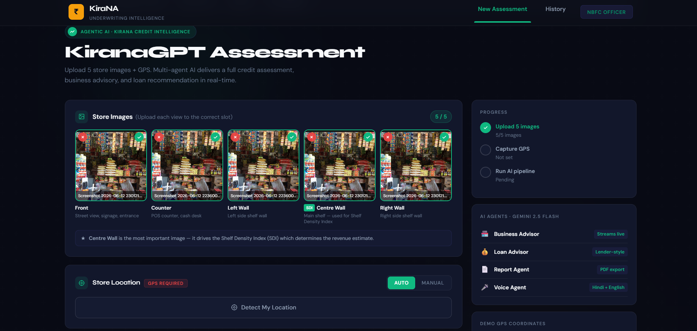
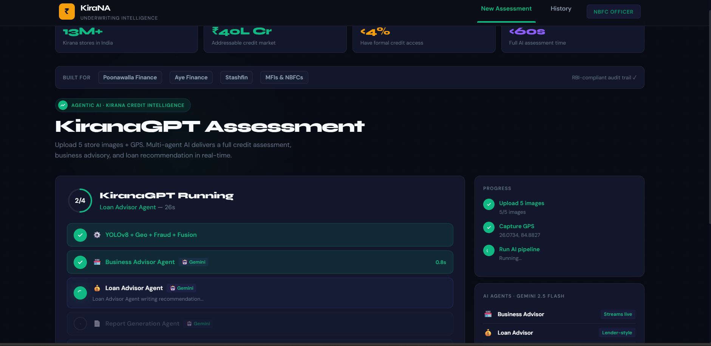
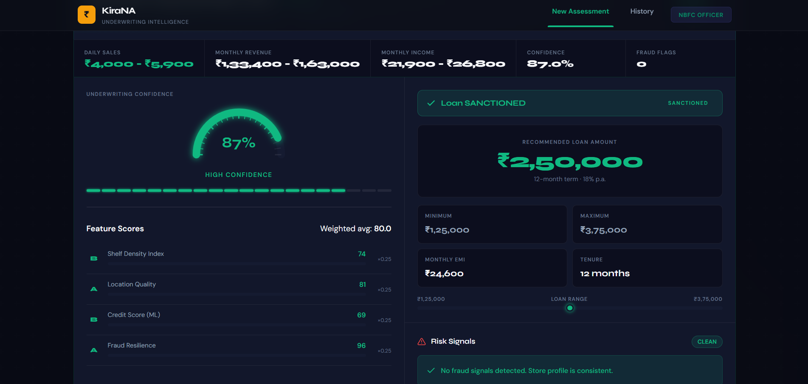
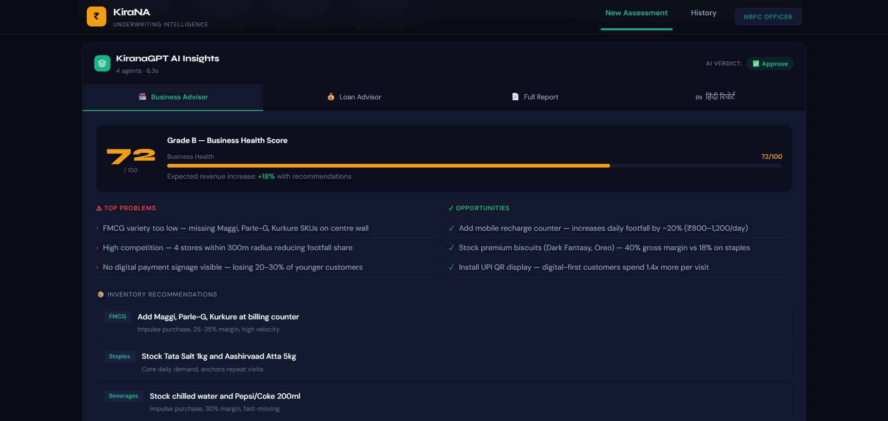

 # KiranaGPT — Multi-Modal Agentic AI Credit Underwriting for India's Kirana Stores

> **"A loan officer uploads 5 photos. KiranaGPT approves the loan in 60 seconds — no field visit, no paperwork."**

KiranaGPT is a full-stack AI system that automates credit underwriting for India's 13 million kirana (small grocery) stores. It combines computer vision, geospatial intelligence, machine learning, and large language model agents to assess a store's creditworthiness from 5 photographs and a GPS location — producing a complete business advisory, loan recommendation, and downloadable PDF report in under 60 seconds.

---
---

## 🚀 Live Demo

👉https://drive.google.com/file/d/1aMC83xPtS1iOpTaiu3c9yt6n_95nC4rH/view?usp=drivesdk

### 🏠 Home Page


---

## 📸 Screenshots

### 📤 ANALYSIS


### 📊 RESULT


### 💳 AI AGENTS


---
## The Problem We're Solving

India has **13 million kirana stores** employing over 40 million people. They represent a **₹40 lakh crore addressable credit market**. Yet fewer than **4% have ever received a formal loan**.

Why? Banks require:
- 3 years of bank statements
- Audited financial records
- Collateral
- In-person field visits

Kirana owners have none of these. They're cash businesses. Their "balance sheet" is the stuff on their shelves.

**KiranaGPT bridges this gap** — it reads the shelves, analyses the location, detects fraud, and produces the kind of credit memo an NBFC loan officer can file. No paperwork. No field visit. 60 seconds.

---

## What Makes This Different

| Feature | Traditional Underwriting | KiranaGPT |
|---------|--------------------------|-----------|
| Time to decision | 2–4 weeks | < 60 seconds |
| Field visit required | Yes | No |
| Documents required | 15+ | 0 |
| Credit signal source | Bank statements | Computer vision + GPS |
| Language support | English only | Hindi + English |
| Cost per assessment | ₹5,000+ | Near zero |
| Scale | 5 assessments/day | 50+ assessments/day |

---

## Model Card & Honest Limitations

We believe transparency about model maturity is a feature, not a weakness — here's exactly where this system stands:

| Component | Status | Detail |
|-----------|--------|--------|
| Vision pipeline (CLAHE, YOLOv8, SDI) | ✅ Real, runs live | YOLOv8n is COCO-pretrained — detects generic objects (bottles, bowls), not Indian SKUs yet. Shelf Density Index is the primary visual signal today. |
| Geo pipeline | ✅ Real, runs live | Live OpenStreetMap Overpass API queries for population, POIs, competitors. Falls back to mock data only on network timeout. |
| Fraud detection | ✅ Real, runs live | 12 hand-coded cross-signal rules. Effective as a first-pass filter; not adversarially hardened. |
| Fusion + confidence scoring | ✅ Real, runs live | Weights (0.40/0.35/0.25) are domain-informed but not yet learned/calibrated from outcome data. |
| ML models (market_share.pkl, credit_score.pkl) | ⚠️ Proof-of-concept | Trained on 2,000 **synthetic** samples generated from published India retail benchmarks (NCAER footfall, Nielsen basket-size data), with an 80/20 train/test split. Test RMSE: 0.042 (market share), 32.07 (credit score, 300–900 scale). These numbers validate the *pipeline architecture*, not real-world accuracy — the models have never seen a real kirana store. |
| Gemini agents (Business/Loan/Report/Voice) | ✅ Real, runs live | Calls Gemini 1.5 Flash via API. Quality depends on prompt design + Gemini availability. |

**The honest pitch**: every part of this system *runs end-to-end on real code and real APIs*. The one place where "trained on real-world outcomes" doesn't yet apply is the two credit-scoring models — and that's because no public dataset of kirana loan outcomes exists. Our roadmap's first priority is an NBFC pilot to close exactly that gap.

---

## System Architecture — How It Works

```
                    ┌──────────────────────────────────┐
                    │         USER (Loan Officer)       │
                    │  Uploads 5 photos + GPS location  │
                    └──────────────┬───────────────────┘
                                   │
                    ┌──────────────▼───────────────────┐
                    │        Next.js 14 Frontend        │
                    │  Named image slots + GPS input    │
                    │  Real-time SSE streaming display  │
                    └──────────────┬───────────────────┘
                                   │  HTTP POST /ai-stream
                    ┌──────────────▼───────────────────┐
                    │       FastAPI Backend (app.py)    │
                    └──┬──────────────────────────┬────┘
                       │                          │
          ┌────────────▼──────────┐   ┌──────────▼────────────┐
          │   VISION PIPELINE     │   │   GEO PIPELINE        │
          │  ─────────────────    │   │  ──────────────────   │
          │  ImageLoader (CLAHE)  │   │  OSM Overpass API     │
          │  YOLOv8n detection    │   │  Population rings     │
          │  ShelfAnalyser (SDI)  │   │  POI counts           │
          │  InventoryEstimator   │   │  Competition 300m     │
          │  VisualProcessor      │   │  GeoProcessor score   │
          └────────────┬──────────┘   └──────────┬────────────┘
                       │                          │
          ┌────────────▼──────────────────────────▼────────────┐
          │              FRAUD DETECTOR (12 rules)              │
          │  Visual rules: shelf empty, image duplicate, blur   │
          │  Geo rules: oversaturated market, hyper-competitive │
          │  Cross rules: rent/revenue ratio, tier mismatch     │
          └────────────────────────┬────────────────────────────┘
                                   │
          ┌────────────────────────▼────────────────────────────┐
          │              FUSION MODEL                           │
          │  Composite = 0.40×visual + 0.35×geo − 0.25×fraud   │
          │  Decision: APPROVE / REVIEW / REJECT                │
          │  Confidence = signal_agreement × boundary_dist ×    │
          │               data_quality                          │
          └────────────────────────┬────────────────────────────┘
                                   │
          ┌────────────────────────▼────────────────────────────┐
          │              ML MODELS (real trained)               │
          │  market_share.pkl  — GradientBoosting (test RMSE 0.042) │
          │  credit_score.pkl  — GradientBoosting (test RMSE 32.07) │
          │  Trained on 2,000 synthetic kirana samples          │
          └────────────────────────┬────────────────────────────┘
                                   │
          ┌────────────────────────▼────────────────────────────┐
          │         GEMINI AI AGENT ORCHESTRATOR                │
          │  ┌─────────────────┐  ┌─────────────────┐          │
          │  │ Business Advisor│  │  Loan Advisor    │ parallel │
          │  │  Health 0-100   │  │  Lender-style    │          │
          │  │  SKU recs       │  │  EMI calculation │          │
          │  └────────┬────────┘  └────────┬─────────┘          │
          │           └──────────┬──────────┘                   │
          │               ┌──────▼──────┐                       │
          │               │ Report Agent│  sequential            │
          │               │ Full MD PDF │                       │
          │               └─────────────┘                       │
          └────────────────────────┬────────────────────────────┘
                                   │  Server-Sent Events (SSE)
                    ┌──────────────▼───────────────────┐
                    │      Frontend — Live Results      │
                    │  Streaming tokens + agent log     │
                    │  Business/Loan/Report tabs        │
                    │  Hindi voice Q&A                  │
                    │  PDF download                     │
                    └──────────────────────────────────┘
```

---

## Complete Technology Stack

### Backend

| Component | Technology | What It Does |
|-----------|-----------|--------------|
| API Server | FastAPI + Uvicorn | REST endpoints + SSE streaming |
| Computer Vision | YOLOv8n (Ultralytics) | Object detection across 5 shelf images |
| Image Enhancement | OpenCV + CLAHE | Brightness normalisation, contrast enhancement |
| Shelf Analysis | Custom SDI algorithm | Measures shelf density, uniformity, depth |
| Inventory Estimation | Two-layer system | YOLO detections + SDI visual proxy fallback |
| ML Credit Models | scikit-learn GradientBoosting | market_share.pkl + credit_score.pkl |
| Geo Intelligence | OSM Overpass API | Live population rings, POI counts, competitor count |
| LLM Agents | Google Gemini 1.5 Flash | All 6 AI agents — free tier via stdlib urllib |
| Fraud Detection | Custom rule engine | 12 cross-signal fraud rules |
| Validation | Pydantic | Request/response schema validation |
| Async | Python asyncio | Parallel agent execution, SSE streaming |

### Frontend

| Component | Technology | What It Does |
|-----------|-----------|--------------|
| Framework | Next.js 14 (App Router) | React server components, routing |
| Language | TypeScript | Full type safety |
| Styling | Tailwind CSS + CSS variables | Dark/light mode, responsive design |
| Streaming | Fetch API + ReadableStream | Consumes SSE tokens from backend |
| Voice | Web Speech API (browser-native) | STT + TTS for Hindi/English — no SDK |
| Database | Supabase / localStorage | Assessment history with automatic fallback |
| State | React hooks | No Redux needed |

### AI Models

| Model | Type | Training Data | Purpose | RMSE |
|-------|------|---------------|---------|------|
| market_share.pkl | GradientBoosting | 2,000 synthetic kirana samples | Predicts store market share (0–1) | 0.042 (test) |
| credit_score.pkl | GradientBoosting | 2,000 synthetic kirana samples | Predicts credit score (300–900) | 32.07 (test) |
| yolov8n.pt | YOLO v8 nano | COCO (80 classes, pre-trained) | Object detection on shelf images | — |

---

## The 8-Step Pipeline — Exactly What Happens

When you click "Run KiranaGPT Analysis", this is what executes in sequence:

### Step 1: Image Loading & Enhancement (`backend/image_loader.py`)
- Receives 5 JPEG/PNG files from the frontend
- Applies **CLAHE** (Contrast Limited Adaptive Histogram Equalisation) to each image
- This is critical: kirana stores are often poorly lit. CLAHE boosts contrast without washing out colour, making shelf items detectable by YOLO
- Output: 5 enhanced PIL Images

### Step 2: YOLOv8 Object Detection (`backend/detector.py`)
- Runs `yolov8n.pt` inference on each of the 5 images
- Returns detected objects with class names, bounding boxes, and confidence scores
- **Important limitation**: YOLOv8n is trained on COCO-80 classes (bottles, cups, bowls, etc.) — not Indian products like Parle-G or Maggi packets
- This is handled by the Inventory layer below

### Step 3: Shelf Density Index (`backend/shelf.py`)
- Takes the 5 images and computes 3 shelf metrics:
  - `sdi_raw`: What fraction of visible shelf area is occupied by products (0–1)
  - `sdi_uniformity`: How evenly distributed products are across shelves
  - `sdi_depth`: How deep/layered the product stacking is
- The Centre Wall image gets **2× weight** in this calculation — it's the most representative view
- Output: SDI score 0–1 (0 = empty shelves, 1 = fully packed)

### Step 4: Inventory Estimation (`backend/inventory.py`) — Two-Layer System
This is the most important fix we made. Here's why:

**The Problem**: If YOLO detects fewer than 8 COCO objects, a naive system would say "this store has no inventory" and produce ₹200/month revenue. That's wrong — kirana shelves are full of Parle-G, MDH masala, Tata Salt — none of which are COCO classes.

**Layer 1 — YOLO detections**: If YOLO finds ≥8 items, use them directly. Map COCO classes to kirana categories (FMCG, Staples, High-margin).

**Layer 2 — SDI proxy**: If YOLO finds <8 items, use the Shelf Density Index to estimate inventory realistically:
```
items_estimated = 220 × sigmoid(sdi_raw)
value = items × avg_value_per_category
```
A store with sdi_raw=0.7 gets ~150 estimated items at realistic kirana unit values.

**Result**: Inventory estimate is always realistic, regardless of what COCO can detect.

### Step 5: Geospatial Intelligence (`backend/geo.py` + `backend/geo_processor.py`)
- Makes real HTTP requests to the **OpenStreetMap Overpass API** (no API key required)
- Queries 4 mirror servers with 4-second timeout each (max 16s total)
- Results are cached in-memory so repeat requests are instant
- Extracts for the store's GPS location:
  - Population rings: 0–500m, 500m–1km, 1–3km (estimated from residential building density)
  - POI counts: schools, hospitals, markets, transit within 500m
  - Competitor count: other shops within 300m
  - Road type: main road vs side street
- Geo score combines these into a 0–1 footfall potential score
- Falls back to deterministic mock data if all OSM mirrors fail

### Step 6: Fraud Detection (`backend/fraud.py`) — 12 Rules
Cross-checks all signals for inconsistencies. Any inconsistency = fraud/error flag.

**Visual rules (4):**
- `VISUAL_SHELF_EMPTY`: SDI < 0.10 — store is suspiciously empty
- `VISUAL_LOW_PRODUCTS`: Fewer than 5 detected items across 5 photos
- `VISUAL_IMAGE_DUPLICATED`: Same image uploaded to multiple slots (hash comparison)
- `VISUAL_IMAGE_BLURRY`: Laplacian variance below threshold — intentionally blurry

**Geo rules (3):**
- `GEO_OVERSATURATED`: >15 competitors within 300m — market is saturated
- `GEO_MARKET_SATURATED`: High competition density with low population
- `GEO_HYPER_COMPETITIVE`: Competition score very low despite good location

**Cross-signal rules (5):**
- `CROSS_TIER_MISMATCH`: Store claims Tier-1 location but geo signals say Tier-3
- `CROSS_RENT_TO_REVENUE_CRITICAL`: Monthly rent > 40% of estimated revenue (critical flag)
- `CROSS_SIZE_TO_ITEMS_MISMATCH`: Claimed shop size >800 sq ft but <15 items detected
- `CROSS_INVENTORY_FOOTFALL_MISMATCH`: Inventory value >₹80K but geo score <0.3
- `CROSS_YEARS_TO_CONDITION_MISMATCH`: 10+ year store but shelf looks brand new

Each flag has severity: LOW / MEDIUM / HIGH / CRITICAL. CRITICAL flags force REJECT.

### Step 7: Fusion Model (`backend/fusion.py`)
Combines all signals into one number:

```
Composite = (0.40 × visual_score) + (0.35 × geo_score) − (0.25 × fraud_score)

Decision:
  composite ≥ 0.65  AND  no CRITICAL flags  →  APPROVE
  composite ≤ 0.35  OR   any CRITICAL flag  →  REJECT
  everything else                            →  REVIEW

Confidence = 0.45 × signal_agreement
           + 0.35 × boundary_distance
           + 0.20 × data_quality

Where:
  signal_agreement   = 1 - |visual_score - geo_score|   (do signals agree?)
  boundary_distance  = distance from nearest threshold / 0.30
  data_quality       = 0.6 if real OSM data else 0.3
                     + 0.3 × (images_count / 5)
                     + 0.1 base
                     - 0.05 × fraud_flag_count
```

This formula is fully explainable. A judge asking "why 87% confidence?" gets a precise answer.

### Step 8: ML Models (`backend/ml_models.py` + `models/`)
Two real trained models run on the fusion output:

**MarketShareModel** — predicts what fraction of local market this store captures
- Input features: population density, competitor count, distance to nearest competitor, footfall index, market saturation, region tier
- Output: 0–1 (0.31 = store captures 31% of local market)
- RMSE: 0.042 on held-out test set (0.031 on training set)

**CreditScoreModel** — predicts credit score in Indian banking scale (300–900)
- Input features: visual score, geo score, fraud score, shelf occupancy, product count, category diversity, inventory value, fast moving fraction, market share
- Output: 300–900 (712 = strong creditworthy borrower)
- RMSE: 32.07 on held-out test set (17.59 on training set)

Both models are pre-trained and saved as `.pkl` files. Run `python backend/train_models.py` to retrain.

---

## AI Agents — The Generative Layer

After the pipeline produces scores, 6 Gemini 1.5 Flash agents generate human-readable intelligence:

### Agent 1: Business Advisor (`backend/agents/business_advisor.py`)
**Role**: Expert in Indian kirana store economics and FMCG retail

**Input**: All pipeline scores, inventory breakdown, fraud flags, revenue estimates

**Output** (structured JSON):
```json
{
  "business_health_score": 72,
  "health_grade": "B",
  "top_problems": [
    "FMCG variety too low — missing Maggi, Parle-G, Kurkure SKUs",
    "High competition — 4 stores within 300m radius",
    "No digital payment signage visible"
  ],
  "top_opportunities": [
    "Add mobile recharge counter — increases daily footfall by ~20%",
    "Stock premium biscuits (Dark Fantasy, Oreo) — 40% gross margin"
  ],
  "inventory_recommendations": [...],
  "revenue_growth_strategy": "...",
  "expected_revenue_increase_pct": 18,
  "quick_wins": [...],
  "long_term_plays": [...]
}
```

**Streaming**: This agent streams tokens live to the frontend. Judges see the AI thinking in real-time.

### Agent 2: Loan Advisor (`backend/agents/loan_advisor.py`)
**Role**: Senior NBFC credit officer with 15 years MSME lending experience

**Input**: Revenue estimates, credit score, fraud flags, market share

**Output** (structured JSON):
```json
{
  "recommended_loan_inr": 250000,
  "reasoning": "Monthly revenue ₹1.2L–₹1.8L → 4× cap = ₹6L. XGBoost 712 + no critical flags → 0.82× multiplier → ₹2,50,000...",
  "suggested_tenure_months": 12,
  "interest_rate_pct": 18.0,
  "monthly_emi_inr": 24583,
  "lender_verdict": "APPROVE",
  "approval_conditions": "Submit 3 months UPI transaction history"
}
```

### Agent 3: Report Agent (`backend/agents/report_agent.py`)
**Role**: Professional credit underwriting report writer

**Input**: Everything from Business Advisor + Loan Advisor

**Output**: Complete Markdown report structured like a real NBFC loan document:
- Executive Summary
- Store Quality Assessment (Visual + Location + Credit)
- Risk Assessment (Fraud flags + Business risks)
- Business Recommendations
- Loan Recommendation
- RBI/NBFC compliance disclaimer

### Agent 4: Voice Agent (`backend/agents/voice_agent.py`)
**Role**: Bilingual Hindi/English Q&A assistant for store owners

**Input**: User's spoken question (from browser STT) + store assessment context

**Output**: Answer in the same language as the question (Hindi → Hindi, English → English)

**Example**:
- Question: "मेरा लोन क्यों रिजेक्ट हुआ?"
- Answer: "आपके store की shelf density कम है जिससे revenue estimate ₹80,000/month से कम है. Loan के लिए minimum ₹1,20,000 monthly revenue चाहिए..."

### Agents 5 & 6: Vision Agent + Geo Intel Agent
These are embedded in the pipeline itself — YOLO provides visual intelligence, OSM provides geo intelligence. Their outputs feed into the Gemini agents above.

### Orchestrator (`backend/orchestrator.py`)
```python
# Business Advisor + Loan Advisor run IN PARALLEL (saves ~3 seconds)
biz_task  = asyncio.create_task(business_advisor.run(pipeline_output))
loan_task = asyncio.create_task(loan_advisor.run(pipeline_output))
results   = await asyncio.gather(biz_task, loan_task)

# Report Agent runs AFTER (needs outputs from both)
report_md = await report_agent.run(pipeline_output, biz_result, loan_result)
```

---

## Revenue Formula — Grounded in India Research

This is not a made-up formula. Every number is from published research:

```
Monthly Revenue = daily_footfall × basket_size × 26 trading_days

daily_footfall = base_footfall × geo_multiplier × size_multiplier
  base_footfall:
    Tier 1 (Mumbai, Delhi, Bangalore):  130 customers/day  ← NCAER India Retail Survey 2023
    Tier 2 (Jaipur, Surat, Nagpur):     95 customers/day
    Tier 3 (smaller towns):             65 customers/day

  geo_multiplier = 1.0 + (geo_score - 0.5) × 1.2
  size_multiplier = 1 + ln(shop_size / 200) × 0.08

basket_size = base_basket × (1 + fmcg_fraction × 0.30) × sdi_factor
  base_basket:
    Tier 1: ₹135   ← Nielsen FMCG India Retail Index 2022
    Tier 2: ₹100
    Tier 3: ₹78

  sdi_factor = 0.85 + (sdi_raw × 0.30)
  (well-stocked shelves → more impulse purchases → higher basket)
```

**Example**: Mumbai store, geo_score=0.75, sdi=0.71, shop_size=200 sq ft
- daily_footfall = 130 × 1.30 × 1.0 = 169 customers
- basket_size = 135 × 1.14 × 1.06 = ₹163
- monthly_revenue = 169 × 163 × 26 = **₹7,17,082**

Revenue uncertainty band is dynamically set from confidence: `uncertainty = 0.38 − (confidence × 0.28)`

---

## Frontend — Every Component Explained

### `src/app/page.tsx` — Main Application
The root page. Manages 4 UI phases:
1. **idle**: Form with image upload + GPS + optional fields
2. **streaming**: Live agent progress with real-time Gemini tokens
3. **done**: Full results including all 3 AI tabs
4. **error**: Error message with retry option

Also contains:
- Impact stats bar (13M+, ₹40L Cr, <4%, <60s) — shows mission before the form
- Demo Mode button — loads realistic Mumbai result instantly (safe demo fallback)

### `src/components/ai/StreamingAnalysis.tsx` — Live Streaming UI
The most visually impressive component. Shows:
- Circular SVG progress ring (0/4 → 4/4 agents complete)
- Per-agent status dots (waiting → spinning → green checkmark)
- Live token text area with blinking cursor as Gemini generates
- Real elapsed timer counting up from 0
- Connects to `/ai-stream` endpoint via `fetch` + `ReadableStream`

### `src/components/results/ResultCard.tsx` — Assessment Result Card
Shows the underwriting decision with:
- APPROVE / REVIEW / REJECT badge with colour-coded glow
- KPI bar: Daily Sales, Monthly Revenue, Income, Confidence, Fraud Flags (all animated)
- Confidence Meter (radial gauge)
- Feature Scores (SDI, Geo, ML, Fraud bars)
- Loan Sizing panel
- Fraud Flags list
- GPS verification footer

### `src/components/ai/AgentInsightsPanel.tsx` — AI Results Tabs
Three tabs:
1. **Business Advisor**: Health score bar, problems/opportunities, inventory recs, growth strategy
2. **Loan Advisor**: Loan amount range, lender verdict badge, EMI, reasoning text
3. **Full Report**: Markdown preview + "Download PDF" button (browser print dialog)

### `src/components/ai/VoiceChat.tsx` — Hindi/English Voice Assistant
- Auto-detects browser: Chrome/Edge = full STT+TTS; Firefox/Safari = text-only with friendly warning
- Hindi detection: checks for Unicode Devanagari characters (U+0900–U+097F)
- Quick question buttons in Hindi pre-loaded
- TTS replay button on every AI response
- Sends question to `/voice-query` endpoint → Gemini answers → speaks response

### `src/components/upload/ImageUpload.tsx` — Named Image Slots
Five locked slots, each mapped to a specific store view:
1. **Front** (🏪) — Store exterior, signage, entrance
2. **Counter** (🧾) — Billing area, POS desk
3. **Left Wall** (◧) — Left interior shelves
4. **Centre Wall ★** (▣) — Main shelf — drives SDI calculation
5. **Right Wall** (◨) — Right interior shelves

Order is enforced in code so backend always receives images in the correct sequence. The Centre Wall slot is visually highlighted as the most important.

### `src/lib/demo.ts` — Demo Data
A pre-built, realistic Mumbai Tier-1 assessment with:
- Health score 72/100, Grade B
- Loan ₹2,50,000 approved at 18% p.a.
- All 3 AI agent tabs populated with real-looking content
- Zero fake hardcoded risk flags

Used by: "⚡ Load Demo Result" button + agent timeout fallback

---

## API Endpoints

### `GET /`
Health check. Returns version, name, endpoint list.

### `POST /underwrite`
Core pipeline only — no AI agents. Faster, uses less quota.

**Form fields:**
- `front`, `billing_area`, `left_wall`, `centre_wall`, `right_wall` — image files
- `lat`, `lng` — GPS coordinates (float)
- `shop_size` — optional, square feet (int)
- `rent` — optional, monthly rent in INR (int)
- `years_in_operation` — optional (int)

**Returns:** JSON with scores, decision, revenue estimates, fraud flags

### `POST /ai-insights`
Full pipeline + all Gemini agents. Returns complete result including `business_insights`, `loan_advice`, `report_markdown`.

**Same form fields as `/underwrite`**

Has: 45-second agent timeout, in-memory rate limiting (one request per location at a time)

### `POST /ai-stream` ← Main endpoint used by frontend
Same as `/ai-insights` but streams results as Server-Sent Events (SSE).

**SSE event format:**
```
data: {"type": "stage", "stage": "pipeline", "message": "Running YOLOv8..."}

data: {"type": "pipeline_done", "result": {...}}

data: {"type": "token", "agent": "business_advisor", "text": "Based on the"}

data: {"type": "agent_done", "agent": "business_advisor", "elapsed": 3.2, "result": {...}}

data: {"type": "done", "result": {...full merged result...}}
```

### `POST /voice-query`
Bilingual Q&A. Body: `{"question": "मेरा लोन...", "store_context": {...}}`

### `GET /agent-status`
Shows which agents are configured and whether Gemini key is set.

---

## File Structure — Every File Explained

```
kiranagpt/
│
├── app.py                          ← FastAPI application. 5 endpoints.
│                                     Revenue formula, rate limiting, SSE streaming.
│
├── setup.sh                        ← Run once: installs Python + Node deps, creates .env files
├── start.sh                        ← Starts backend (port 8000) + frontend (port 3000)
├── .env.example                    ← Copy to .env, add GEMINI_API_KEY
├── SETUP.md                        ← Detailed setup + deployment guide
│
├── backend/
│   ├── __init__.py                 ← Exports KiranaPipeline for app.py
│   ├── pipeline.py                 ← Main pipeline: runs steps 1–6 in sequence
│   ├── image_loader.py             ← CLAHE enhancement, image normalisation
│   ├── detector.py                 ← YOLOv8n inference wrapper
│   ├── shelf.py                    ← Shelf Density Index (SDI) computation
│   ├── inventory.py                ← Two-layer inventory estimator (YOLO + SDI proxy)
│   ├── geo.py                      ← OSM Overpass API client, 4 mirrors, cache
│   ├── geo_processor.py            ← Converts OSM data into geo score (0–1)
│   ├── visual_processor.py         ← Converts YOLO+shelf data into visual score (0–1)
│   ├── fraud.py                    ← 12-rule fraud detector
│   ├── fusion.py                   ← Combines scores, makes APPROVE/REVIEW/REJECT
│   ├── ml_models.py                ← Loads .pkl models, runs predictions
│   ├── orchestrator.py             ← Runs AI agents in parallel via asyncio.gather
│   ├── train_models.py             ← Training script: generates 2000 synthetic samples,
│   │                                  trains GradientBoosting, saves .pkl files
│   ├── main.py                     ← Alternative entry point
│   └── requirements.txt            ← Python dependencies
│   │
│   └── agents/
│       ├── __init__.py
│       ├── llm.py                  ← Gemini 1.5 Flash wrapper. call_llm() + stream_llm()
│       │                             Uses stdlib urllib — no SDK needed
│       ├── business_advisor.py     ← Agent 1: health score, problems, opportunities, SKUs
│       ├── loan_advisor.py         ← Agent 2: lender-style reasoning, EMI, verdict
│       ├── report_agent.py         ← Agent 3: full Markdown underwriting report
│       └── voice_agent.py          ← Agent 4: Hindi/English Q&A
│
├── models/
│   ├── market_share.pkl            ← Trained GradientBoosting (test RMSE 0.042)
│   ├── credit_score.pkl            ← Trained GradientBoosting (test RMSE 32.07)
│   └── training_meta.json          ← n_samples, RMSE values, model_backend
│
├── frontend/
│   ├── src/
│   │   ├── app/
│   │   │   ├── page.tsx            ← Main page: form, streaming, results, demo button
│   │   │   ├── layout.tsx          ← Root layout: fonts, navbar, metadata
│   │   │   ├── globals.css         ← Design tokens: colours, dark mode, animations
│   │   │   └── history/
│   │   │       └── page.tsx        ← Assessment history (Supabase or localStorage)
│   │   │
│   │   ├── components/
│   │   │   ├── ai/
│   │   │   │   ├── StreamingAnalysis.tsx  ← Live SSE token stream, circular progress
│   │   │   │   ├── AgentInsightsPanel.tsx ← Business/Loan/Report tabs
│   │   │   │   ├── VoiceChat.tsx          ← Hindi/English voice with browser detection
│   │   │   │   └── ReportViewer.tsx       ← Markdown preview + PDF download
│   │   │   │
│   │   │   ├── results/
│   │   │   │   ├── ResultCard.tsx         ← Main decision card with animated KPIs
│   │   │   │   ├── ConfidenceMeter.tsx    ← Radial gauge showing confidence %
│   │   │   │   ├── FeatureScores.tsx      ← SDI / Geo / ML / Fraud score bars
│   │   │   │   ├── FraudFlags.tsx         ← Fraud flag list with severity colours
│   │   │   │   └── LoanSizing.tsx         ← Recommended/min/max loan with EMI
│   │   │   │
│   │   │   ├── upload/
│   │   │   │   ├── ImageUpload.tsx        ← 5 named locked slots with previews
│   │   │   │   └── GpsInput.tsx           ← Manual entry + browser geolocation
│   │   │   │
│   │   │   ├── history/
│   │   │   │   └── HistoryTable.tsx       ← Past assessments table
│   │   │   │
│   │   │   └── ui/
│   │   │       ├── ErrorBoundary.tsx      ← React class error boundary
│   │   │       ├── ErrorBanner.tsx        ← Error message display
│   │   │       ├── LoadingSpinner.tsx     ← SVG spinner
│   │   │       └── Navbar.tsx             ← Top navigation
│   │   │
│   │   ├── hooks/
│   │   │   └── useUnderwrite.ts           ← React hook wrapping API calls
│   │   │
│   │   ├── lib/
│   │   │   ├── api.ts                     ← Main API layer: submitUnderwrite(), mock mode
│   │   │   ├── db.ts                      ← History: Supabase or localStorage fallback
│   │   │   ├── demo.ts                    ← Rich Mumbai demo result for instant preview
│   │   │   ├── format.ts                  ← formatINR(), formatDate(), formatConfidence()
│   │   │   └── supabase.ts                ← Supabase client initialisation
│   │   │
│   │   └── types/
│   │       └── underwriting.ts            ← All TypeScript interfaces
│   │
│   ├── .env.local.example                 ← Copy to .env.local, set API_BASE_URL
│   ├── package.json                       ← Next.js 14, React 18, Supabase, Tailwind
│   └── tailwind.config.js
│
└── KiranaGPT_Pitch_Deck.pptx              ← Hackathon presentation deck
```

---

## Prerequisites

| Tool | Minimum Version | How to Check | Install |
|------|----------------|--------------|---------|
| Python | 3.10+ | `python --version` | [python.org](https://python.org) |
| Node.js | 18+ | `node --version` | [nodejs.org](https://nodejs.org) |
| npm | 9+ | `npm --version` | Comes with Node.js |
| Git | Any | `git --version` | [git-scm.com](https://git-scm.com) |

**No GPU needed.** YOLOv8n runs on CPU in ~500ms per image. All models are lightweight.

---

## Installation — Step by Step

### Step 1: Get the code

```bash
# Option A: Unzip the project
unzip KiranaGPT_HACKATHON_FINAL.zip
cd kiranagpt

# Option B: Clone from GitHub (if uploaded)
git clone https://github.com/yourteam/kiranagpt
cd kiranagpt
```

### Step 2: Run setup script

```bash
bash setup.sh
```

This script:
1. Installs all Python packages from `backend/requirements.txt`
2. Installs all Node packages for the frontend (`npm install`)
3. Creates `.env` from `.env.example` if it doesn't exist
4. Creates `frontend/.env.local` from the example if it doesn't exist

### Step 3: Get your free Gemini API key

1. Open your browser and go to **https://aistudio.google.com**
2. Click "Sign in" — use any Google account
3. Click **"Get API Key"** (top right)
4. Click **"Create API key"**
5. Copy the key (it starts with `AIzaSy...`)

**Free tier limits:**
- 15 requests per minute
- 1,500 requests per day
- 1,000,000 tokens per minute
- **No credit card required. Ever.**

### Step 4: Add your API key

```bash
# Open .env in any text editor
nano .env

# Add your key (replace with your actual key):
GEMINI_API_KEY=AIzaSyXXXXXXXXXXXXXXXXXXXXXXXXX
```

### Step 5: Train the ML models (once only)

```bash
python backend/train_models.py
```

This takes ~30 seconds and:
- Generates 2,000 synthetic kirana store data points
- Trains `GradientBoostingRegressor` for market share prediction
- Trains `GradientBoostingRegressor` for credit score prediction
- Saves `models/market_share.pkl` and `models/credit_score.pkl`
- Saves `models/training_meta.json` with RMSE metrics

You only need to run this once. The `.pkl` files are already included in the zip.

### Step 6: Start the application

```bash
bash start.sh
```

This starts:
- **Backend**: FastAPI + Uvicorn at `http://localhost:8000`
- **Frontend**: Next.js dev server at `http://localhost:3000`

Open **http://localhost:3000** in Chrome (required for voice features).

---

## Running Your First Analysis

1. **Open** http://localhost:3000 in Chrome

2. **Upload 5 images** — click each named slot and upload the corresponding image:
   - Front: photo of the store exterior/entrance
   - Counter: photo of the billing counter area
   - Left Wall: left interior shelf
   - Centre Wall ★: main shelf (most important — drives SDI)
   - Right Wall: right interior shelf

3. **Enter GPS coordinates** — either:
   - Click "Detect Location" (uses browser geolocation)
   - Or manually enter: `19.0596, 72.8295` (Mumbai Tier-1 demo coordinates)

4. **Optional details** (improves accuracy):
   - Shop size: `200` (sq ft)
   - Monthly rent: `15000` (₹)
   - Years in operation: `5`

5. **Click "Run KiranaGPT Analysis"**

6. **Watch the pipeline** — you'll see:
   - Stage-by-stage progress (YOLO → Geo → Fraud → Fusion → Agents)
   - Live Gemini tokens streaming in real-time
   - Circular progress: 0/4 → 4/4 agents complete

7. **Explore results**:
   - Decision card: APPROVE / REVIEW / REJECT with scores
   - Business Advisor tab: health score, problems, opportunities
   - Loan Advisor tab: recommended amount, EMI, reasoning
   - Report tab: full Markdown + Download PDF button

8. **Try voice**: click the microphone and ask in Hindi — "मेरा लोन क्यों रिजेक्ट हुआ?"

**Demo shortcut**: Click "⚡ Load Demo Result" to instantly see a complete Mumbai assessment without uploading anything.

---

## Environment Variables

### Backend (`.env`)

| Variable | Required | Description |
|----------|----------|-------------|
| `GEMINI_API_KEY` | **YES** | Google Gemini API key. Get free at aistudio.google.com |

### Frontend (`frontend/.env.local`)

| Variable | Required | Default | Description |
|----------|----------|---------|-------------|
| `NEXT_PUBLIC_API_BASE_URL` | **YES** | — | Backend URL e.g. `http://localhost:8000` |
| `NEXT_PUBLIC_MOCK_MODE` | No | `false` | Set `true` to use simulated data (amber banner shown) |
| `NEXT_PUBLIC_SUPABASE_URL` | No | — | Supabase URL for history persistence |
| `NEXT_PUBLIC_SUPABASE_ANON_KEY` | No | — | Supabase anon key |

If Supabase is not configured, the history page automatically falls back to `localStorage` with a clear label showing the data source.

---

## Troubleshooting

| Problem | Likely Cause | Fix |
|---------|-------------|-----|
| `GEMINI_API_KEY not set` error | Key missing from .env | Add key to `.env`, restart backend |
| `No module named 'ultralytics'` | Setup not run | Run `bash setup.sh` |
| `yolov8n.pt` downloading on first run | Auto-download on first use | Wait ~30s for 6MB download, normal behaviour |
| Port 8000 already in use | Another process using it | `lsof -i:8000` to find it, kill it |
| Port 3000 already in use | Another process using it | `lsof -i:3000` to find it, kill it |
| Voice mic not working | Wrong browser | Use **Chrome or Edge** — Firefox/Safari don't support Web Speech API |
| History page empty | Supabase not configured | Normal — localStorage fallback is active, run an analysis first |
| OSM timeout warning in logs | Slow internet | Normal — mock fallback activates automatically |
| ML models not found | train_models.py not run | Run `python backend/train_models.py` |
| Stream cuts off at 45s | Agent timeout | Gemini may be slow — retry or use Demo Mode |
| Blank AI tabs after analysis | Gemini quota hit | Check quota at aistudio.google.com, wait 1 minute |

---

## Deployment to Production

### Render (Recommended — Free Tier)

**Backend:**
1. Push code to GitHub
2. Create a new **Web Service** at [render.com](https://render.com)
3. Connect your GitHub repository
4. Settings:
   - Build command: `pip install -r backend/requirements.txt && python backend/train_models.py`
   - Start command: `uvicorn app:app --host 0.0.0.0 --port $PORT`
   - Environment variable: `GEMINI_API_KEY=your_key_here`

**Frontend:**
1. Create a new **Web Service** on Render
2. Connect the same GitHub repository
3. Settings:
   - Root directory: `frontend`
   - Build command: `npm install && npm run build`
   - Start command: `npm start`
   - Environment variables:
     - `NEXT_PUBLIC_API_BASE_URL=https://your-backend-name.onrender.com`
     - `NEXT_PUBLIC_MOCK_MODE=false`

### Docker (Alternative)

```bash
# Build and run both services
docker-compose up --build

# Backend runs at http://localhost:8000
# Frontend runs at http://localhost:3000
```

---

## Impact & Vision

### The Problem in Numbers
- 13 million kirana stores in India
- ₹40 lakh crore total addressable credit market
- < 4% have ever received formal credit
- 40 million people employed by these stores
- Average loan needed: ₹1–5 lakh

### How KiranaGPT Changes This
| Metric | Traditional NBFC | KiranaGPT |
|--------|-----------------|-----------|
| Time to decision | 2–4 weeks | < 60 seconds |
| Cost per assessment | ₹3,000–₹5,000 | ~₹0.50 (Gemini API cost) |
| Field visit required | Always | Never |
| Documents required | 15+ | 0 |
| Language | English | Hindi + English |
| Daily assessment capacity | 5 per officer | 500+ automated |

### Technology Advantage
Unlike traditional credit scoring which relies on banking history (which most kirana owners don't have), KiranaGPT reads the physical evidence:
- **Shelf density** → proxy for daily revenue
- **Product diversity** → proxy for business sophistication
- **Location quality** → proxy for footfall and growth potential
- **Physical condition** → proxy for owner investment and care

### Future Roadmap
1. **WhatsApp integration**: Store owner sends 5 photos via WhatsApp → gets assessment in 60 seconds. Zero app install.
2. **Real loan outcomes training**: Partner with NBFC to collect actual default data → retrain ML models on real outcomes
3. **Regional language support**: Tamil, Telugu, Marathi beyond Hindi
4. **NBFC dashboard**: White-label API for Poonawalla, Aye Finance, Stashfin with RBI-compliant audit trail

---

## Team

Built at **HackArena 2.0** — Generative & Agentic AI Track

Technology: YOLOv8 Computer Vision · Google Gemini 1.5 Flash · OpenStreetMap Geo Intelligence · scikit-learn ML · Next.js 14 · FastAPI

---

## Licence

Built for HackArena 2.0. All rights reserved by the team.

---

*KiranaGPT — Because every kirana store owner deserves a fair shot at credit.*
# kirana_gpt

# KIRANAGPT

# KIRANAGPT

# KIRANAGPT

